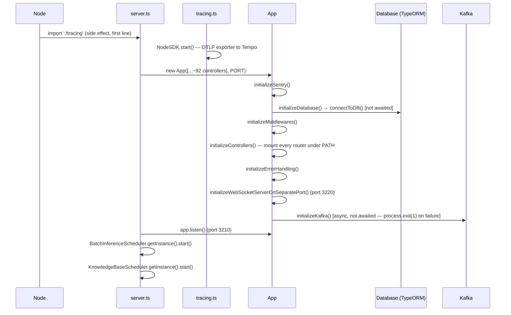
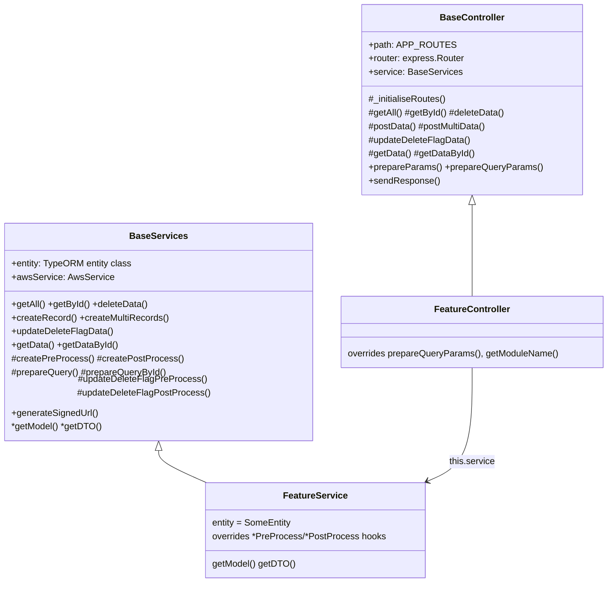

# Architecture — Q0-Application-Service

System shape: boot sequence, request lifecycle, the CRUD template every feature is built on, and the data/messaging layers around it.

_Last verified: 2026-08-07 (kb-builder)_ · Back to [AGENTS.md](../AGENTS.md) · See also [product-and-stack.md](product-and-stack.md) · [api-contracts.md](api-contracts.md)

## Process boot sequence

`src/server.ts` is the actual entry point (not `app.ts`, which only defines the `App` class):

**Ordering hazard**: `app.listen()` is called immediately after `new App(...)` returns. Neither the DB connection nor Kafka init is awaited first — the HTTP server can begin accepting requests (and hitting `this.entity.find(...)` calls that assume a live connection) before Postgres or Kafka are actually ready. There is no retry logic in `src/database/database.ts` — a failed connect just logs and the rejection propagates unhandled. There is also no graceful shutdown for the HTTP server, DB pool, or Kafka connections on `SIGTERM`/`SIGINT` — only `tracing.ts` has a `SIGTERM` handler, and it only tears down the OpenTelemetry SDK.

`PORT` (3210) and `WEBSOCKET_PORT` (3220) are **hardcoded constants** in `src/config.ts`, not read from environment variables.

## Request lifecycle (HTTP)

Global middleware chain in `App.initializeMiddlewares()` (`src/app.ts`), in registration order:

1. `requestTraceMiddleware` — assigns/propagates `x-request-id`/`x-session-trace-id`, sets response headers, logs a structured access line on `res.on('finish')` correlated with the active OpenTelemetry span.
2. Swagger UI mounted at `/api-docs` and `${PATH}/api-docs`, with a client-side AES encrypt/decrypt interceptor for Try-it-out bodies (uses a hardcoded key — cosmetic, matches the API's own body-encryption behavior described below).
3. `express.json({ limit: "100mb" })`
4. `express.urlencoded({ extended: true })`
5. `multer({ limits: { fileSize: 50MB } }).any()` — global, in-memory, unrestricted field names; every route effectively accepts file uploads whether it uses them or not.
6. `cors()` — no options, i.e. all origins allowed.
7. `helmet()` — registered **after** CORS/body-parsers/multer, not first; if you're debugging a header-related issue, check whether an earlier middleware already touched the response.
8. Inline **request-body decryption gate**: if `ENABLE_ENCRYPTION` (hardcoded `true` in `config.ts`) and the request is `POST` and the URL isn't in `NON_ENCRYPTION_ENDPOINTS` or `/importExcel`, decrypts `req.body.data` via `EncryptionAndDecryption.decryption(...)` (AES, `src/core/Encryption&Decryption.ts`) before any controller sees it. Responses get the mirror treatment in `BaseController.sendResponse()` via `ApiResponse.prepare()`.
9. Per-controller routers mounted under `PATH` (`/Infer/api`) in `initializeControllers()`.
10. Error handling: `Sentry.setupExpressErrorHandler(this.app)` first (must come after all controllers, per the code comment), then a catch-all that checks `this.pathList` to distinguish "path exists, wrong method" (`MethodNotFoundError`) from a true 404 (`NotFoundError`), both dispatched through `ApiError.handle`.

A **second, fully separate Express app + HTTP server** runs on `WEBSOCKET_PORT` (3220) purely for WebSocket traffic (`WebSocketService.init(...)`) — WS connections never go through the main app's middleware chain above.

## The CRUD template: `BaseController` + `BaseServices`

This is the single most important structural fact about the codebase: **nearly all ~92 mounted controllers extend `BaseController`, and every service extends `BaseServices`.** New features are built by supplying the pieces this template asks for, not by writing routes by hand.

`BaseController._initialiseRoutes()` registers, behind `authMiddleware`, unless a subclass overrides `_initialiseRoutes()` entirely (many do — see [api-contracts.md](api-contracts.md) for which):

| Method | Path | Notes |
|---|---|---|
| GET | `{path}/getall` | No pagination/filter — full list via `prepareParams` hook. |
| GET | `{path}/getbyid/:id` | |
| DELETE | `{path}/delete/:id` | Hard delete path — but see below, it's actually routed through `deleteData` which still respects soft-delete semantics per entity. |
| POST | `{path}/save` | + `validationFDMiddleware(dto, metaModel)` — validates body **and** any uploaded files against the feature's DTO/MetaModel. |
| POST | `{path}/updateDeleteFlagData` | Soft-delete: body `{ id: number \| number[] }` → sets `is_delete = 1` for one or many rows (`In(...)` query). |
| POST | `{path}/savemulti` | Bulk create, same validation as `save`. |
| POST | `{path}/getdata` | Body is a `Pagination` object (`pageNumber`, `pageSize`, `filter`, `sortBy`, `sortType`, `company_id`, `search_text`, `is_delete`) — the actual filtering logic lives in the feature's `prepareQuery` override. |
| POST | `{path}/getdatabyid` | Same `Pagination` shape, single-record variant. |

`BaseServices.createRecord()` chains, via `.then()`: `createPreProcess → findEntity → saveData → uploadFiles → updateFileData → createPostProcess` — file upload is woven directly into the generic create pipeline, not a separate step a feature has to remember to call.

**To add a new feature**, per the pattern actually used ~90 times in this repo:
1. Add an entity in `src/entities/` extending `InferencingEntity`.
2. Add `src/database/repository/<feature>/<feature>.model.ts` (plain class with field defaults) and `<feature>.dto.ts` (`class-validator` decorated).
3. Add `src/services/<feature>/<feature>Service.services.ts` extending `BaseServices`, implementing `getModel()`/`getDTO()`, overriding only the hooks the feature actually needs.
4. Add `src/controllers/<feature>/<feature>Controller.controller.ts` extending `BaseController`.
5. Add the path to `APP_ROUTES` in `src/core/AppRoutes.ts`.
6. **Import and instantiate the controller in `src/server.ts`'s array** — skipping this step is the single most common way a feature silently does nothing (see below).

## Error handling & response shape

Two parallel error mechanisms coexist, scoped to different layers:

- **`src/core/ApiError.ts`** — an `ErrorType` enum + `ApiError.handle(err, res)` static dispatcher, used by auth/middleware code and the global error handler. Special-cases Postgres codes `23503` (FK violation) and `23505` (unique violation) into friendly messages.
- **`src/core/ErrorCodes.ts`** — a flat map of string codes (`E10001`…) to `{type, message, status}`, resolved only at the `BaseController.handleError()` boundary. Services reject with the bare string code (e.g. `Promise.reject('E10020')`); no service throws `ApiError` directly. Match this convention in new service code.

Every response goes through `GenericResponse<T>` (`{status, error, details, msg}`, business-level `StatusCode` enum e.g. `'10000'` success — distinct from the HTTP status code) and, on the way out, `ApiResponse.prepare()` re-encrypts `details` unless the route is `/security/*`, `/inference*`, or another entry in `NON_ENCRYPTION_ENDPOINTS`.

## Data layer

- `src/database/data-source.ts` — one TypeORM `DataSource`, Postgres, port `5432` fixed, `synchronize: false`, `logging: false`, an **explicit array of ~100 imported entity classes** (not a glob), pool `max:10/min:1`.
- `src/database/database.ts` — singleton `Database.getInstance()`; `connectToDB()` initializes the DataSource once; `executeExternalQuery(sql, params)` runs raw parameterized SQL through the `EntityManager` for anything the Active-Record API can't express.
- **No `Repository<T>` usage** — every service calls static/instance methods directly on the entity class (`ModelEntity.findOneBy(...)`, `this.entity.createQueryBuilder()...`), Active-Record style.
- **Soft delete everywhere** — `is_delete` (0/1) on every row via the shared `InferencingEntity` base; hand-written queries must filter `is_delete = 0` themselves, there is no global scope doing it automatically.

## Kafka & Redis

- **Kafka client is `node-rdkafka`**, not the `kafkajs` package also listed in `package.json` (zero imports of `kafkajs` found in `src/` — dead dependency). `src/utils/kafka/KafkaService.ts` is the singleton producer/consumer wrapper; `src/utils/kafka/consumers.ts` is the live topic→handler registry (pod lifecycle, compile/deployment/training/batch-inference status, credit updates, notifications, quota-reached alerts with a 5-minute in-memory de-dupe). Every outbound message is auto-enriched with `is_enterprise` and `is_reserved`/`reservation_id` inside `KafkaService.sendMessage()` — features don't need to add these fields themselves.
- **Redis is pub/sub only**, not a cache. `src/utils/webSocket/webSocketService.ts` uses it purely to fan a WebSocket broadcast out to every pod (`WEBSOCKET_REDIS_CHANNEL`, default `ws-broadcast`) so a company's connected clients get pushed updates regardless of which pod they're attached to. Degrades gracefully (pod-local delivery only) if `WEBSOCKET_REDIS_URL` isn't set.

## Observability

- **OpenTelemetry** (`src/tracing.ts`) — `NodeSDK` with an OTLP HTTP exporter pointed at a Grafana Tempo endpoint (`OTEL_EXPORTER_OTLP_ENDPOINT`, falling back to a hardcoded dev-cluster URL), auto-instrumentation enabled for HTTP/Express/pg/redis/kafkajs, explicitly disabled for `fs`/`dns`.
- **Sentry** (`src/utils/sentry.ts`) — conditional on `APPLICATION_SENTRY_DSN`; 100% trace and profile sampling (`tracesSampleRate`/`profilesSampleRate: 1.0` — worth knowing before enabling in a high-traffic environment).
- **`requestTraceMiddleware`** bridges request IDs to OTEL trace IDs in the access log, so Loki log lines can be correlated to a Tempo trace.

## Known gotchas / dead code

Flagging these because they change how you should read nearby code — not aspirational fixes, just what IS:

- **`src/middlewares/authMiddleware.ts`**: the DB-session lookup (`MemberLoginsEntity` by `member_id`+`access_token`+`is_delete:0`) runs, but the `if (!loginUserdetail)` rejection is commented out. A structurally valid, non-expired JWT passes `authMiddleware` even with no matching session row in the DB — logout/session-revocation does not actually block reuse of an already-issued token at this layer.
- **No role/permission-enforcement middleware exists.** `RolesEntity`/`ModulesEntity`/`RoleModulePermissionEntity` model RBAC data, but nothing in `src/middlewares/` reads it. If a route needs role gating, someone has to write that check by hand inside the handler — none currently do, based on the survey in [api-contracts.md](api-contracts.md).
- **Hardcoded secrets in source**: several config values and credentials (JWT signing key, encryption key, SMTP credentials) are checked in as literal strings across the codebase and CI config rather than sourced from env/secrets management. Don't copy this pattern for new code, and don't propagate these values further than they already are.
- **Dead controllers under `src/controllers/login/`**: `loginController.ts`, `verifyEmailController.ts`, `resendVerificationController.ts`, `googleAuth/*` are empty files; `forgotPasswordControllet.ts` (note the typo in the filename), `resetPasswordController.ts`, `signUpController.ts` have real code but are **never imported in `src/server.ts`**, so their routes don't exist at runtime. The live equivalents are `src/controllers/loginController/loginController.ts` and `src/controllers/login/refreshTokenController.ts`/`updatePasswordController.ts` (which *are* registered).
- **`HostedZoneController` is instantiated twice** in `src/server.ts` (both bound to `APP_ROUTES.HOSTEDZONE`) — harmless (Express just gets two identical route sets on the same path) but is repo hygiene debt, not an intentional pattern.
- **Two SQL-injection-shaped call sites**: `src/services/model/modelService.services.ts` and `src/utils/pricing/pricingService.ts` build SQL via string interpolation against `Database.getInstance().executeExternalQuery(...)` instead of parameterized queries, unlike the rest of the codebase's TypeORM query-builder usage.
- **`dashboardEntity.ts` is a 0-byte empty file** — `DashboardController`'s base CRUD is mounted but has no real backing entity; treat `/dashboard/*` as non-functional.
- **`AppRoutes.ts` has unused enum entries** (`SIGNUP`, `FORGOTPASSWORD`, `RESETPASSWORD`, `VERIFYEMAIL`, `RESENDVERIFICATION`, `GoogleOAuth`, `INFRASPECSMAPPER`, `CLOUDZONE`) with no live controller behind them — don't assume an `APP_ROUTES` entry implies a mounted route; cross-check `src/server.ts`.
